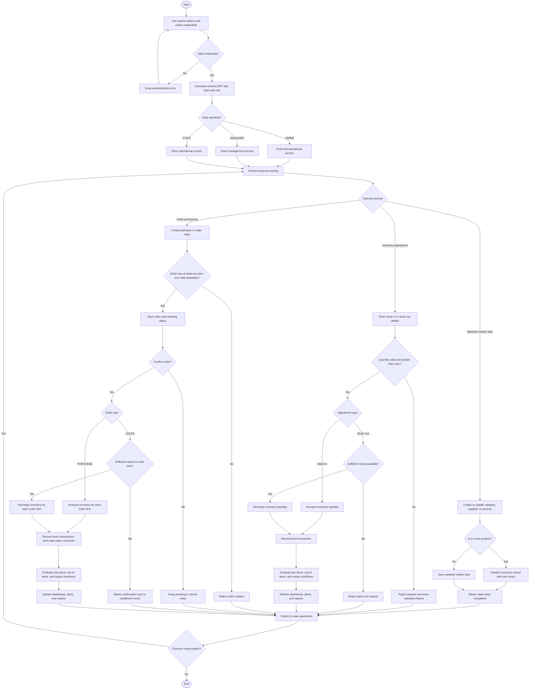

# Stock Management UML Activity Diagram

This diagram captures the high-level business activity flow implemented in the current `stock_management` system.

## Validation Coverage

- Admin can log in and maintain categories, suppliers, and products.
- New product creation includes automatic inventory initialization.
- Manager can create and confirm purchase orders that increase stock.
- Staff can create and confirm sales orders that decrease stock.
- Sales and stock-out operations fail when stock is insufficient.
- Inventory changes trigger low-stock or out-of-stock evaluation.
- Expiring products feed the expiry alert path.
- Dashboard, alerts, and reports consume the updated inventory and transaction state.
