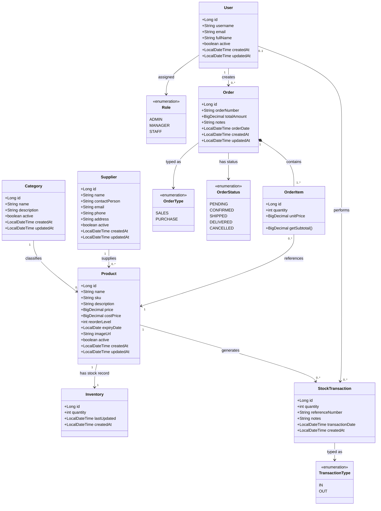

# Stock Management Domain Model

## Conceptual Classes

The core conceptual classes in the stock management domain are:

- `User`: system actor who logs in and performs business operations.
- `Role`: classification of a user as `ADMIN`, `MANAGER`, or `STAFF`.
- `Category`: groups products into business-defined catalog types.
- `Supplier`: external party that provides products.
- `Product`: sellable or purchasable inventory item with SKU, pricing, reorder level, and optional expiry date.
- `Inventory`: current stock record maintained for exactly one product.
- `Order`: business transaction representing a purchase order or sales order.
- `OrderItem`: line item inside an order, linking a product to quantity and unit price.
- `OrderType`: identifies whether an order is `PURCHASE` or `SALES`.
- `OrderStatus`: lifecycle state of an order such as `PENDING`, `CONFIRMED`, or `CANCELLED`.
- `StockTransaction`: audit record of every stock movement.
- `TransactionType`: identifies whether stock moved `IN` or `OUT`.

## Domain Notes

- A `Product` belongs to one `Category` and may be associated with one `Supplier`.
- Each `Product` has one `Inventory` record that stores the current quantity on hand.
- A `User` creates `Order` records and may also perform stock transactions.
- An `Order` is composed of one or more `OrderItem` entries.
- Each `OrderItem` references exactly one `Product`.
- Confirmed purchase orders increase stock; confirmed sales orders decrease stock.
- `StockTransaction` preserves the history of stock movement for a `Product`.

## UML Class Diagram

## Interpretation

- The domain centers on `Product`, because catalog setup, inventory, ordering, and stock history all depend on it.
- `Inventory` models the current stock state, while `StockTransaction` models the historical movement of stock.
- `Order` and `OrderItem` capture commercial activity, with type and status controlling how inventory is affected.
- `User` and `Role` represent authorization and accountability for operations in the system.
