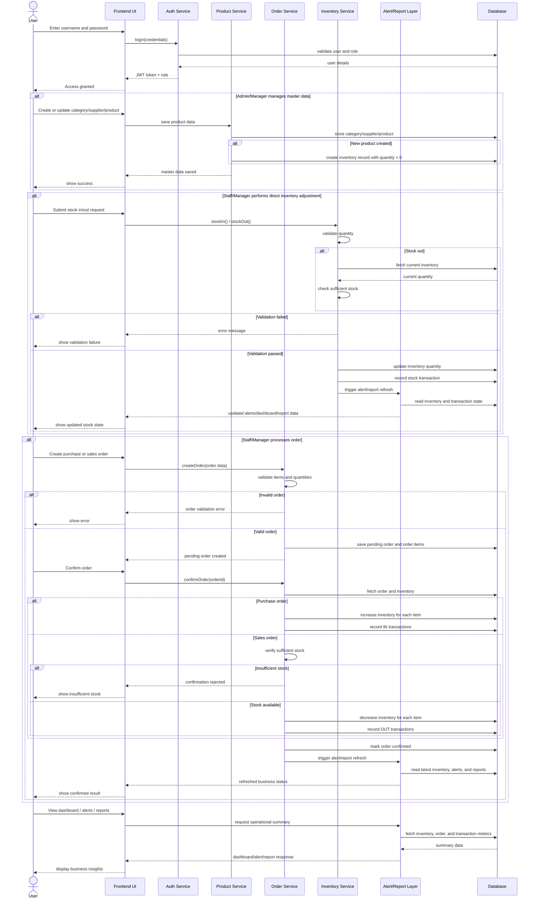

# Stock Management UML Sequence Diagram

This sequence diagram shows the main interaction flow between the user, frontend, backend services, and database for the stock management system.

## Purpose

- Shows how the user interacts with the frontend and backend services.
- Shows where validation happens before inventory changes.
- Shows how product creation initializes inventory.
- Shows how purchase and sales orders affect stock differently.
- Shows how alerts, dashboard data, and reports are refreshed after stock movement.
