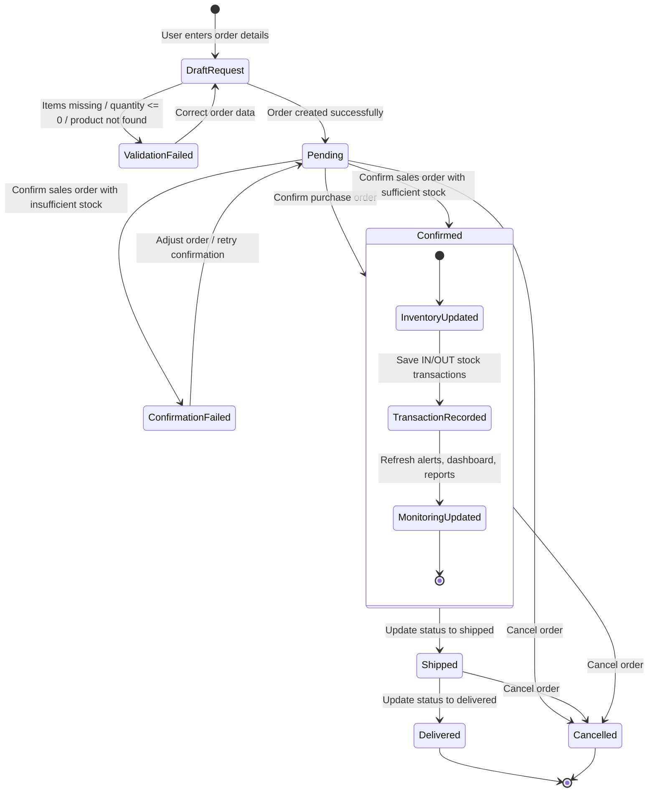

# Stock Management UML State Chart Diagram

This state chart focuses on the `Order` lifecycle, because order processing is the clearest state-driven behavior implemented in the current stock management system.

## State Descriptions

- `DraftRequest`: order data is being prepared by the user.
- `ValidationFailed`: order creation or confirmation fails because business rules are not satisfied.
- `Pending`: valid order is created and waiting for confirmation or cancellation.
- `ConfirmationFailed`: confirmation attempt fails, usually because sales stock is insufficient.
- `Confirmed`: order is accepted and inventory changes are applied.
- `Shipped`: confirmed order has moved forward in fulfillment.
- `Delivered`: order has completed its lifecycle.
- `Cancelled`: order is terminated before completion.

## Business Meaning

- Every new order starts as a request and must pass validation before becoming `Pending`.
- Only `Pending` orders can be confirmed in the current backend logic.
- Confirming a purchase order increases stock.
- Confirming a sales order decreases stock only if enough inventory exists.
- After confirmation, the system records stock transactions and refreshes alerts, dashboard values, and reports.
- Delivered and cancelled states are terminal outcomes in the business lifecycle.
